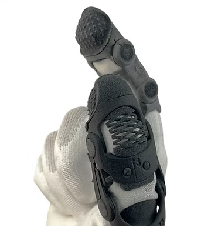
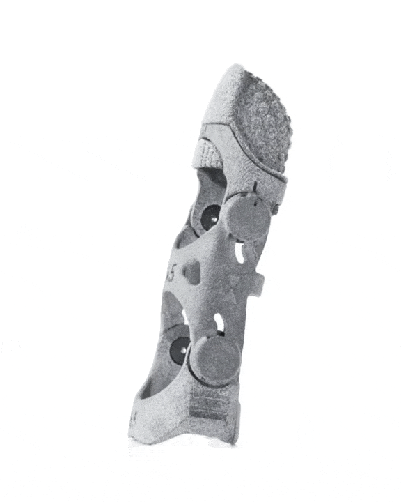

<!-- Banner -->

<h1> <i> Wellcome to Digity </i> </h1>

<!-- General Information  -->

  

     
     
    <b><em>Digity</em>, donde reinventamos la protección y el rendimiento de las manos con tecnología ergonómica de vanguardia. 
    Nuestra misión es fusionar ingeniería avanzada, diseño centrado en el ser humano y soluciones portables para prevenir lesiones, 
    potenciar la eficiencia y garantizar un entorno laboral más seguro. Con nuestro enfoque en innovación y excelencia, 
    transformamos los desafíos cotidianos en oportunidades para un desempeño más saludable, conectado y confiable.</b>
  

 
 
 

<!-- Team -->

<h1> <i> Digity Team </i> </h1>

  

     
    <b><em>Digity</em> fue fundada con la visión de redefinir la protección de las manos, combinando tecnología avanzada con diseño ergonómico.
    La empresa desarrolla soluciones innovadoras para prevenir lesiones laborales como la sobreextensión de articulaciones y el esfuerzo repetitivo,
    priorizando la seguridad, la comodidad y el rendimiento. Hoy, DIGITY sigue liderando la creación de soluciones portables que potencian las 
    capacidades humanas y transforman la seguridad en el entorno laboral.</b>
  

 
 
 

<!-- Proyect Information (Flagship) -->

<h1> <i> Proyect Artus </i> </h1>

  

     
     
     <b><em>Artus</em>, nuestro modelo insignia probado y certificado como equipo de protección personal (PPE) busca minimizar las lesiones de
    larga duración en las manos asegurando menos días enfermo y un flujo de trabajo consistente. Protege contra condiciones degenerativas como
    la Artritis y mantiene a los empleados en forma y productivos previniendo una jubilación anticipada, además, fomenta un lugar de trabajo
    seguro y cómodo, reduciendo así costos de rotación.
    
     <ul> Mejor Proteccion </ul>
     <ul> Más Productividad </ul>
     <ul> Menos Lesiones </ul>
   </b>
  

  

 
 
 
 

<!-- News -->

